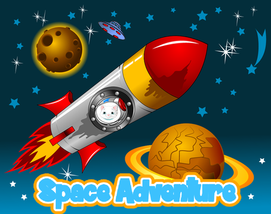

# Space Adventure (space invaders)

Space Adventure is a game I created using Pygame library. 

I started this project when I saw the [demonstration](https://www.youtube.com/watch?v=vhiO4WsHA6c) from [Chrisspresso](https://github.com/Chrispresso/SnakeAI).
I read his [project page](https://chrispresso.io/AI_Learns_To_Play_Snake) and then wanted to create my own version.
The architecture is similar, but I used my own images and added the following features :smiley: !


## Gameplay  

To play the game, use :
 
- `LEFT ARROW` to move left,
- `RIGHT ARROW` to move right,
- `SPACE` to shoot enemies  
 
## Cover



## Getting Started

### Install

1. Install Python and pygame ==> `pip install pygame==2.0.1`

2. Clone and copy this repository

```
$ git clone https://github.com/alicevillar/space-invaders
```

3. `python main.py`
 
### Features
 


### Resources:

[Pygame Tutorial for Beginners - Python Game Development Course](https://www.youtube.com/watch?v=FfWpgLFMI7w&t=6893s)
